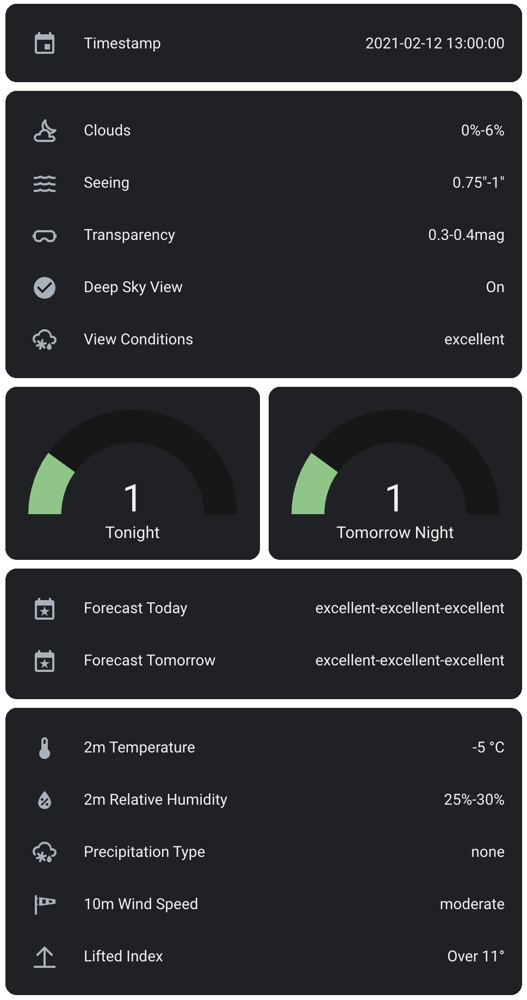

# AstroWeather

This is a *Custom Integration* for [Home Assistant](https://www.home-assistant.io/). It uses the forecast data from 7Timer! to create sensor data for Home Assistant. It uses the public [Machine-readable API](http://www.7timer.info/doc.php?lang=en#machine_readable_api) to pull data from 7Timer!.


[](https://github.com/custom-components/hacs)

There is currently support for the following device types within Home Assistant:

* Sensor
* Binary Sensor

Forecast data is provided by 7Timer! on a three *hourly* basis.

## Installation

### HACS installation

This Integration is part of the default HACS store, so go to the HACS page and search for *AstroWeather*.

### Manual Installation

To add AstroWeather to your installation, create this folder structure in your /config directory:

`custom_components/astroweather`.

Then drop the following files into that folder:

```yaml
__init__.py
binary_sensor.py
config_flow.py
const.py
entity.py
manifest.json
sensor.py
strings.json
translation (Directory with all files)
```

## Configuration

To add AstroWeather to your installation, go to the Integration page inside the configuration panel and AstroWeather.

During installation you will have the option to:

* verify the longitude and latitude for the forecast
* set the elevation
* set the interval for updating forecast data

The interval for updating forecast data can also be changed after you add the Integration, by using the *Options* link on the Integration widget.

## Lovelace Example

There is no Lovelace card so far. It may come at some days :-).

Below is my current configuration. The two gauge cards display the todays and tomorrows viewing conditions forecast which are calculated for the time in between 9pm to 3am. Range is in between 1 and 5, whereby 1 is excellent and five is bad.



The full configuration:

```yaml
type: vertical-stack
cards:
  - type: entities
    entities:
      - entity: sensor.astroweather_timestamp
  - type: entities
    entities:
      - entity: sensor.astroweather_clouds_plain
      - entity: sensor.astroweather_seeing_plain
      - entity: sensor.astroweather_transparency_plain
      - entity: binary_sensor.astroweather_deep_sky_view
      - entity: sensor.astroweather_view_condition_plain
  - type: horizontal-stack
    cards:
      - type: gauge
        entity: sensor.astroweather_forecast_today
        min: 0
        max: 5
        severity:
          green: 0
          yellow: 2
          red: 4
        name: Tonight
      - type: gauge
        entity: sensor.astroweather_forecast_tomorrow
        min: 0
        max: 5
        severity:
          green: 0
          yellow: 2
          red: 4
        name: Tomorrow Night
  - type: entities
    entities:
      - entity: sensor.astroweather_forecast_today_plain
      - entity: sensor.astroweather_forecast_tomorrow_plain
  - type: entities
    entities:
      - entity: sensor.astroweather_2m_temperature
      - entity: sensor.astroweather_2m_relative_humidity_plain
      - entity: sensor.astroweather_precipitation_type
      - entity: sensor.astroweather_10m_wind_speed_plain
      - entity: sensor.astroweather_lifted_index_plain
```

## Sensors

The following sensors are being added to Home Assistant:

* *binary_sensor.astroweather_deep_sky_view* - True, if current conditions should allow deep sky observation.
* *sensor.astroweather_10m_wind_direction* - Wind Humidity at 10m height.
* *sensor.astroweather_10m_wind_speed* - Wind Speed
* *sensor.astroweather_10m_wind_speed_plain* - Wind Speed in plain text
* *sensor.astroweather_2m_relative_humidity* - Relative Humidity at 2m
* *sensor.astroweather_2m_relative_humidity_plain* - Relative Humidity at 2m in plain text
* *sensor.astroweather_2m_temperature* - Temperature at 2m
* *sensor.astroweather_clouds* - Cloud Cover
* *sensor.astroweather_clouds_plain* - Cloud Cover in plain text
* *sensor.astroweather_elevation* - Elevation configured for this AstroWeather instance
* *sensor.astroweather_forecast_today* - Forecast for viewing conditions this evening (9pm to 3am)
* *sensor.astroweather_forecast_today_plain* - Forecast in plain text
* *sensor.astroweather_forecast_tomorrow* - Forecast for viewing conditions tomorrow evening (9pm to 3am)
* *sensor.astroweather_forecast_tomorrow_plain* - Forecast in plain text
* *sensor.astroweather_latitude* - Latitude configured for this AstroWeather instance
* *sensor.astroweather_lifted_index* - Lifted Index
* *sensor.astroweather_lifted_index_plain* - Lifted Index in plain text
* *sensor.astroweather_longitude* - Longitude configured for this AstroWeather instance
* *sensor.astroweather_precipitation_type* - Expected Precipitation Type in plain text
* *sensor.astroweather_seeing* - Seeing Conditions
* *sensor.astroweather_seeing_plain* - Seeing Conditions in plain text
* *sensor.astroweather_timestamp* - Timestamp of current Conditions
* *sensor.astroweather_transparency* - Atmospheric Transparency
* *sensor.astroweather_transparency_plain* - Atmospheric Transparency in plain text
* *sensor.astroweather_view_condition* - Current Viewing Conditions
* *sensor.astroweather_view_condition_plain* - Current Viewing Conditions in plain text
* *sensor.astroweather_sun_next_setting* - Next setting of the Sun, calculated for the astronomical twilight (-18°)
* *sensor.astroweather_moon_next_rising* - Next rising of the Moon
* *sensor.astroweather_moon_next_setting* - Nect setting of the Moon
* *sensor.astroweather_moon_phase* - Current Moon phase in percentage

They all have a Unique ID, so you can rename them to whatever you like afterwards.

## Definition of Output Value

Taken from [7timer.info](http://www.7timer.info/doc.php?lang=en#machine_readable_api).

Variable | Value | Meaning
-------- | ----- | -------
Cloud Cover | 1 | 0%-6%
|| 2 | 6%-19%
|| 3 | 19%-31%
|| 4 | 31%-44%
|| 5 | 44%-56%
|| 6 | 56%-69%
|| 7 | 69%-81%
|| 8 | 81%-94%
|| 9 | 94%-100%
Seeing | 1 | <0.5"
|| 2 | 0.5"-0.75"
|| 3 | 0.75"-1"
|| 4 | 1"-1.25"
|| 5 | 1.25"-1.5"
|| 6 | 1.5"-2"
|| 7 | 2"-2.5"
|| 8 | >2.5"
Transparency| 1 | <0.3
|| 2 | 0.3-0.4
|| 3 | 0.4-0.5
|| 4 | 0.5-0.6
|| 5 | 0.6-0.7
|| 6 | 0.7-0.85
|| 7 | 0.85-1
|| 8 | >1
Lifted Index | -10 | Below -7
|| -6 | -7 to -5
|| -4 | -5 to -3
|| -1 | -3 to 0
|| 2 | 0 to 4
|| 6 | 4 to 8
|| 10 | 8 to 11
|| 15 | Over 11
2m Temperature | -76 to 60 | -76C to +60C
2m Relative Humidity | 0 to 100 | 0% to 100%
10m Wind Direction | N, NE, E, SE, S, SW, W, NW
10m Wind Speed | 1 | Below 0.3m/s (calm)
|| 2 | 0.3-3.4m/s (light)
|| 3 | 3.4-8.0m/s (moderate)
|| 4 | 8.0-10.8m/s (fresh)
|| 5 | 10.8-17.2m/s (strong)
|| 6 | 17.2-24.5m/s (gale)
|| 7 | 24.5-32.6m/s (storm)
|| 8 | Over 32.6m/s (hurricane)
Precipitation Type | snow, rain, frzr (freezing rain), icep (ice pellets), none
