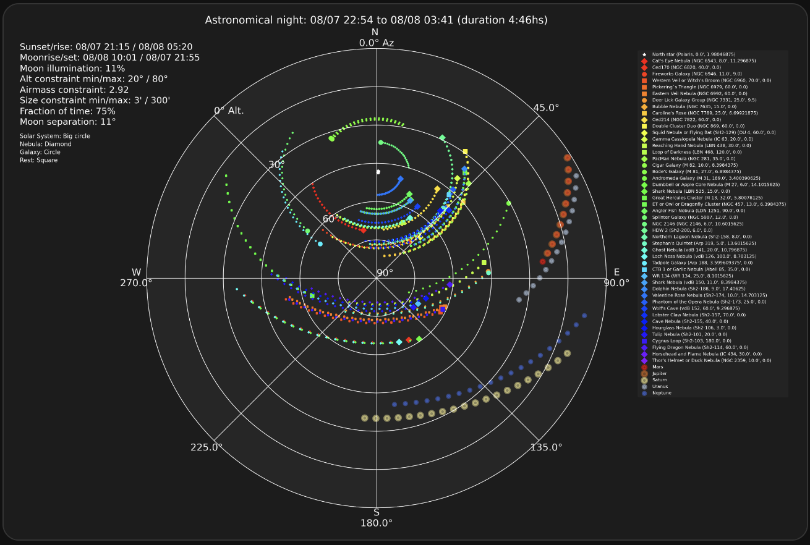

# AstroWeather<!-- omit in toc -->


[](https://github.com/custom-components/hacs)


This is a *Custom Integration* for [Home Assistant](https://www.home-assistant.io/) 2023.9+. It uses the forecast data from [Met.no](https://api.met.no/weatherapi/locationforecast/2.0/documentation) and optionally [Open-Meteo](https://open-meteo.com/en/docs) and [7Timer!](http://www.7timer.info/doc.php?lang=en#machine_readable_api) to generate sensor data for an astronomical condiditions forecast in Home Assistant.


There is currently support for the following entity types within Home Assistant:

* Sensor
* Binary Sensor
* Weather

There is also a custom weather card available [here](https://github.com/mawinkler/astroweather-card) as seen in the screenshot above.

> ***Other Peojects by me***:
> 
> [AstroLive](https://github.com/mawinkler/astrolive) - Monitor your observatory from within Home Assistant.
>
> [UpTonight](https://github.com/mawinkler/uptonight) - Calculate the best astro photography targets (deep sky objects, planets, and comets) for the night at a given location.

## Table of Content<!-- omit in toc -->

- [How It Works](#how-it-works)
- [Usage](#usage)
  - [HACS installation](#hacs-installation)
  - [Manual Installation](#manual-installation)
  - [Configuration](#configuration)
  - [Lovelace](#lovelace)
- [UpTonight (optional)](#uptonight-optional)

## How It Works

- The AstroWeather integration has a dependency to [pyastroweatherio](https://github.com/mawinkler/pyastroweatherio) which is in charge to retrieve the forecast data and do the required calculations.
- During setup of the integration you're asked for some location info via a config flow.
- AstroWeather will then create a couple of sensors, binary sensors and a weather component to integrate with Home Assistant.
- For Lovelace you can either build your own configuration or use the [AstroWeather Card](https://github.com/mawinkler/astroweather-card). The card does provide a config editor for customization.
- All data is updated within a configurable interval in between 1 minute to 4 hours.
- It is possible to use multiple instances of AstroWeather at the same time, even within different timezones.

## Usage

### HACS installation

This Integration is part of the default HACS store, so go to the HACS page and search for *AstroWeather* within the integrations.

### Manual Installation

To add AstroWeather to your installation, create this folder structure in your /config directory:

`custom_components/astroweather`.

Then drop the following files into that folder:

```yaml
__init__.py
binary_sensor.py
config_flow.py
const.py
entity.py
manifest.json
sensor.py
strings.json
weather.py
translation (Directory with all files)
```

### Configuration

To add AstroWeather to your installation, go to the Integration page inside the configuration panel and AstroWeather.

During installation you will have the option to:

- verify the longitude and latitude for the forecast
- set the elevation
- set the timezone
- set the interval for updating forecast data
- set the weightings for for the condition calculation
- (optional) set the path pointing to your `/conf/www`-directory. Required only for UpTonight (see below)
- (optional) enable or disable experimental features. When enabled, AstroWeather will calculate the astronomical seeing, transparency and lifted index on the available data of Met.no and does not use 7Timer.
- (optional) enable one of the supported Open-Meteo services.

The interval for updating forecast data and the weightings can also be changed after you add the Integration, by using the *Options* link on the Integration widget.

### Lovelace

There is a custom weather card available [here](https://github.com/mawinkler/astroweather-card).

It contains some of the sensor values as additional state attributes for use in the custome Lovelace card.

## UpTonight (optional)

[](http://www.astropy.org/)
[](https://rhodesmill.org/skyfield/)

Ever wanted to know tonights best possible targets? Astroweather in combination with [UpTonight](https://github.com/mawinkler/uptonight) is here to help. UpTonight calculates the best astro photography targets for the night at a given location. The default built in deep sky object list is a merge of Gary Imm's [My Top 100 Astrophotography Targets](https://www.astrobin.com/uc8p37/) and the top 200 taken from his incredible [Deep Sky Compendium](http://www.garyimm.com/compendium). In addition, UpTonight calculates the observability of the solar system bodies. Finally, it can calculate the brightest visible comets based on the [Minor Planet Center](https://www.minorplanetcenter.net/data) database.

UpTonight uses AstroPy which cannot be used asynchronously, so it needs to be separated from Home Assisntant.

Please refer to the documentation of [UpTonight](https://github.com/mawinkler/uptonight) on how to get it running. Below is the setup I'm using:

I run Home Assistant as a Container. It's `config`-directory is mapped to `/home/markus/smarthome/homeassistant`. Ideally run UpTonight via docker-compose.yaml. Example:

```yaml
version: "3.2"
services:
  homeassistant:
    container_name: homeassistant
    image: homeassistant/home-assistant:2023.10
    depends_on:
      - influxdb
      - mqtt
    volumes:
      - /home/markus/smarthome/homeassistant:/config
      - /etc/localtime:/etc/localtime:ro
      - /etc/timezone:/etc/timezone:ro
    ports:
      - 8123:8123
    restart: always
    network_mode: host

  uptonight:
    image: mawinkler/uptonight:latest
    container_name: uptonight
    environment:
      - LONGITUDE=48d7m36.804s
      - LATITUDE=11d34m38.352s
      - ELEVATION=519
      - TIMEZONE=Europe/Berlin
      - PRESSURE=1.022
      - TEMPERATURE=18
      - RELATIVE_HUMIDITY=0.7
    volumes:
      - /home/markus/smarthome/homeassistant/www:/app/out
```

The UpTonight container is not continuously running. When started it does the calculation, drops the output to the file system, and the exits. This just takes a couple of seconds.

To update the targets on a daily basis I run UpTonight every lunch time via cron:

```cron
0 12 * * * /usr/local/bin/docker-compose -f /home/markus/docker-compose.yaml up uptonight
```

For Home Assistant two files are relevant:

- `uptonight-report.json` - The calculated deep sky objects.
- `uptonight-bodies-report.json` - The calculated solar system bodies (planets).
- `uptonight-comets-report.json` - The calculated comets.
- `uptonight-plot.png` - A plot of the astronomical night.

To embed the list of targets into my Lovelace I use the markdown card. In the below example Astrobin search links and links to the altitude vs. time diagrams are embedded.

```yaml
type: markdown
content: |-
  <h2>
    <ha-icon icon='mdi:creation-outline'></ha-icon>
    UpTonight DSO
  </h2>
  <hr>

  
    
      
        
          <table><tr>
          
          
          <a href="https://astrobin.com/search/?q={{ astrobin }}">{{ item.name }}</a><br>{{ item.type }} in {{ item.constellation }},
          <a href="http://homeassistant.local:8123/local/uptonight-alttime-{{ alttime }}.png" target="_blank" rel="noopener noreferrer">Graph</a>
        
      
    
  
    Waiting for AstroWeather
  
  </tr></table>

<h2>
  <ha-icon icon='mdi:creation-outline'></ha-icon>
  UpTonight DSO
</h2>
<hr>
```

The resulting list is sorted top down according to the fraction of time obeservable during astronomical darkness. It shows only the top 20 targets including [AstroBin](https://www.astrobin.com/) search links.

If you're interested in our solar system bodies you can list them similarily:

```yaml
type: markdown
content: |-
  <h2>
    <ha-icon icon='mdi:creation-outline'></ha-icon>
    UpTonight Bodies
  </h2>
  <hr>

  
    
      <table><tr>
      {{ loop.index }}. {{ item.name }}, Alt: {{ item.max_altitude | round}}°, Az: {{ item.azimuth | round }}° at {{ item.max_altitude_time | as_local | as_timestamp | timestamp_custom('%H:%M') }}, Mag: {{ item.visual_magnitude | round(1) }},
      <a href="http://homeassistant.local/local/uptonight-alttime-{{ item.name | lower }}.png" target="_blank" rel="noopener noreferrer">Graph</a>
    
  
    Waiting for AstroWeather
  
  </tr></table>
```

Are you looking for comets?:

```yaml
type: markdown
content: |-
  <h2>
    <ha-icon icon='mdi:creation-outline'></ha-icon>
    UpTonight Comets
  </h2>
  <hr>

  
    
      <table><tr>
      {{ loop.index }}. {{ item.designation }}, Mag: {{ item.visual_magnitude | round(1) }}, Rise time: {{ item.rise_time | as_local | as_timestamp | timestamp_custom('%H:%M') }}, Distance: {{ item.distance_au_earth | round(2) }}au,
      <a href="http://homeassistant.local/local/uptonight-alttime-{{ item.designation | lower | replace('/', '-') }}.png" target="_blank" rel="noopener noreferrer">Graph</a>
    
  
    Waiting for AstroWeather
  
  </tr></table>
```

For the plot, a picture-entity card showing a template image does the trick for me. I'm using [browser_mod](https://github.com/thomasloven/hass-browser_mod) from @thomasloven for the tap_action to get a zoomed view.

Template Image:

```yaml
template:
  - trigger:
    - platform: time_pattern
      # This will update every ten minutes
      minutes: /10
  - image:
    - name: UpTonight
      url: http://192.168.1.115:8123/local/uptonight-plot.png
```

Picture entity:

```yaml
type: picture-entity
entity: image.uptonight
camera_view: live
show_state: false
show_name: false
tap_action:
  action: fire-dom-event
  browser_mod:
    service: browser_mod.popup
    data:
      title: UpTonight
      size: wide
      content:
        type: picture-entity
        entity: image.uptonight
```

Result:


